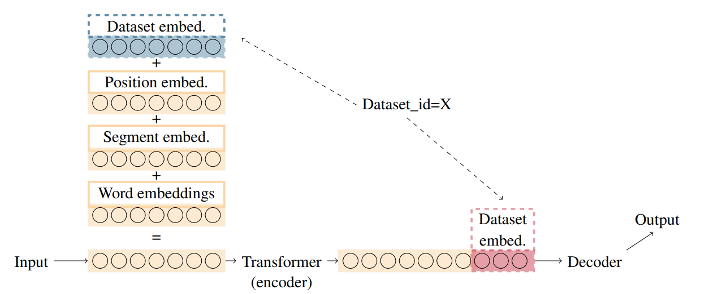

### Dataset Embeddings
[back to main README](../README.md)

Previous work has shown that for neural network models it can be beneficial to encode properties (i.e. origin/language) of the input utterance as an embedding, and concatenate it to the word embedding before passing it throught the model. This was first done by embedding the language ([Ammar et al., 2016](https://www.aclweb.org/anthology/Q16-1031/)), but later also to indicate different data sources ([Stymne et al., 2018](https://www.aclweb.org/anthology/P18-2098/)). We use the universal term dataset embeddings in MaChAmp.

Most previous work has used dataset embeddings in BiLSTMs where the input size to the encoder is not fixed, so they could simply concatenate the dataset embeddings to the word embedding. However, when using transformer based language models (as commonly done in machamp), the input size to the encoder is fixed. We thus proposed two varieties of incorporating dataset embeddings, explained in more detail in van der Goot and de Lhoneux (2021). In short: we either sum the dataset embedding to the word(piece) embedding, or concatenate it to the encoded vector before passing it into the decoder. Both of these approaches are illustrated in the following figure:

[]()

Since version 0.4, we only support encoder based embeddings (summing to the input); for decoder embeddings, we refer to older versions of MaChAmp (0.3).

In the dataset configuration, dataset embeddings can be added on the dataset level by specifying its column index:

```
{
    "UD": {
        "train_data_path": "data/ewt.train",
        "validation_data_path": "data/ewt.dev",
        "word_idx": 1,
        "dataset_embed_idx": 9,
        "tasks": {
            "upos": {
                "task_type": "seq",
                "column_idx": 3
            }
        }
    }
}
```

In the above example, the dataset id will be read from the 9th column. By setting the index to -1, the name of the dataset in the configuration file is used as identifier (in this case `UD'). This can similarly be done for sentence level tasks.

The data should then look as follows (note that the 10th column is completely empty besides the dataset label):

```
# newdoc id = weblog-juancole.com_juancole_20051126063000_ENG_20051126_063000
# sent_id = weblog-juancole.com_juancole_20051126063000_ENG_20051126_063000-0001
# text = Al-Zaman : American forces killed Shaikh Abdullah al-Ani, the preacher at the mosque in the town of Qaim, near the Syrian border.
1       Al      Al      PROPN   NNP     Number=Sing     0       root    _       blog
2       -       -       PUNCT   HYPH    _       1       punct   _       blog
3       Zaman   Zaman   PROPN   NNP     Number=Sing     1       flat    _       blog
4       :       :       PUNCT   :       _       1       punct   _       blog
5       American        american        ADJ     JJ      Degree=Pos      6       amod    _       blog
6       forces  force   NOUN    NNS     Number=Plur     7       nsubj   _       blog
7       killed  kill    VERB    VBD     Mood=Ind|Tense=Past|VerbForm=Fin        1       parataxis       _       blog
```


