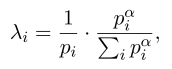
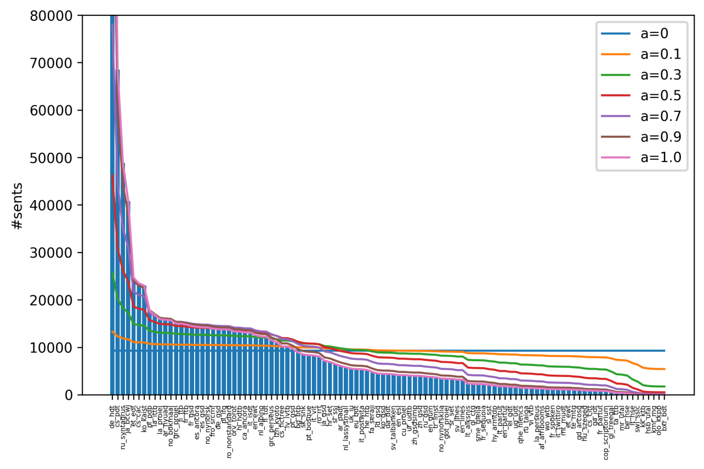

### Proportional sampling

[back to main README](../README.md)

When training on multiple datasets, it might be undesirable to use all data
from each dataset during an epoch, because one dataset might be much larger. To
mitigate this issue, we implemented a simple dataset smoothing strategy. If
`sampling_smoothing` in `data_loader/batch_sampler/` is set to any value lower
than 1.0 in the [hyperparameters](hyper.md), this will be enabled.

Smoothing is done by a multinomial distribution, similar as used for mBERT and
XLM-r for smoothing the sizes of their training data (on language level). The
weights for each dataset is proportional to the square root of its invert
frequency. This smoothing can be regulated with one variable; if it is set to
1.0, the original data sizes will be used, if it set to 0.0, it will use 1
average size for all datasets. The formula is as follows:

We plotted the effect of this parameter on all UD training data sets. The effect
of the parameter can clearly be seen in the plot:

In MaChAmp, we do the sampling on the batch level, not the sentence level, and
we do this after generating the batches, so that each epoch can have different
instances to train on.

